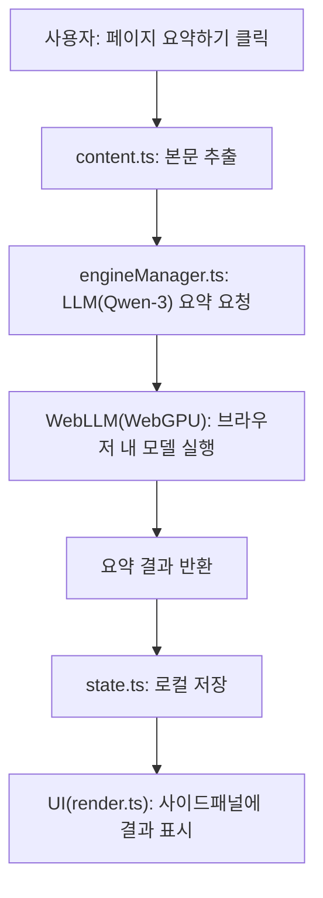

# NoServer.ai

**On-device Web Summarizer for Chrome**

NoServer.ai는 WebLLM을 활용하여 서버 전송 없이 사용자의 브라우저에서 직접 웹페이지를 요약하는 Chrome 확장 프로그램입니다. 개인정보 유출 없이, 오프라인에서 동작하며, API 키나 회원가입이 필요 없습니다.

[🛠 Chrome 웹스토어에서 설치하기](https://chromewebstore.google.com/detail/noserverai/pibgbfelegjdiiohmgamhaegfkinbfjg?authuser=0&hl=en)

---

## 주요 특징

- **Qwen-3 LLM 기반 고성능 요약**: 최신 LLM을 브라우저 내에서 직접 실행
- **완전한 로컬 처리**: 요약 데이터가 외부 서버로 전송되지 않음
- **오프라인 모드 지원**: 인터넷 연결 없이도 사용 가능
- **간편한 사이드패널 UI**: 직관적인 요약 및 기록 관리
- **요약 기록 자동 저장**: 로컬 스토리지에 요약 내역 저장
- **무료, 가입/API키 불필요**

---

## 💡 이런 데 쓸 수 있어요

- 긴 뉴스 기사 → 요약해서 SNS에 공유할 때
- 블로그나 기술 문서를 빠르게 훑고 싶을 때
- 내부망/인트라넷 문서를 오프라인에서 요약하려고 할 때
- 민감한 정보를 다루는 환경에서 서버 없는 LLM 요약이 필요할 때

---

## 기술적 개요

- **확장 구조**: Manifest V3 기반 Chrome Extension
- **주요 엔진**: [@mlc-ai/web-llm](https://github.com/mlc-ai/web-llm) (Qwen-3 LLM, WebGPU 활용)
- **본문 추출**: [@mozilla/readability](https://github.com/mozilla/readability)
- **로컬 저장**: Chrome Storage API로 요약 기록 관리

### 폴더/파일 구조

- `src/background.ts`: 서비스워커, 데이터 관리, 메시지 라우팅
- `src/engine/engineManager.ts`: LLM 엔진 초기화 및 요약 처리
- `src/content.ts`: 웹페이지 본문 추출
- `src/sidepanel.ts`, `src/ui/`: 사이드패널 UI 및 이벤트 처리
- `src/state/state.ts`: 요약 기록 및 상태 관리
- `src/sw/serviceWorkerAPI.ts`: 서비스워커와의 통신 API

---

## 🧠 Why These Technologies?

- **WebLLM + WebGPU**: 서버 전송 없이 로컬에서 LLM을 실행할 수 있는 대표적인 오픈소스 프레임워크입니다. WebGPU를 활용해 최신 GPU에서 빠른 추론이 가능하며, 개인정보가 외부로 유출되지 않는다는 장점이 있습니다.
- **Qwen-3 모델**: 여러 경량 LLM 중 한글 등 다국어 요약 품질이 우수하고, 브라우저에서 실행 가능한 크기(Qwen3-4B-q4f16_1-MLC)로 실사용에 적합합니다. (공식 벤치마크 및 커뮤니티 평가에서 우수한 성능을 보임)
- **@mozilla/readability**: 웹페이지의 본문을 구조적으로 추출하는 안정적 라이브러리로, 수동 XPath/CSS Selector 없이도 주요 텍스트를 정확히 추출할 수 있습니다.
- **Manifest V3**: 최신 크롬 확장 API를 사용하여 보안성과 성능을 모두 확보합니다.

---

## 요약 동작 흐름 (Flowchart)



---

## 성능 이슈 및 한계점

- **모델 최초 로딩 지연**: 첫 실행 시 수백 MB의 모델이 다운로드되어 1~2분의 대기 시간이 발생할 수 있습니다(이후 재다운로드 없음).
- **WebGPU 호환성**: WebGPU를 지원하지 않는 환경(구형 브라우저, 일부 OS/드라이버)에서는 동작하지 않습니다. Chrome 113+ 및 최신 GPU 필요.
- **메모리 사용량**: 대형 모델 특성상, 구형 PC나 저사양 환경에서는 성능 저하 또는 브라우저 크래시가 발생할 수 있습니다.
- **요약 길이 제한**: 3,000자 이하의 텍스트에서 최적 성능을 보장합니다.

---

## 개발 및 빌드

```bash
npm install
npm run build
```

- Chrome 확장 프로그램 → "압축해제된 확장 프로그램"으로 `dist` 폴더 로드

---

## 시스템 요구사항

- Chrome 113 이상 + WebGPU 지원 GPU 필요
- 최초 실행 시 수백 MB의 모델 다운로드(1~2분 소요, 최초 1회)
- 3,000자 이하 텍스트에서 최적 성능

---

## 추천 대상

- 개인정보 유출 없이 AI 요약을 원하는 사용자
- 클라우드 의존 없이 LLM을 활용하고 싶은 개발자
- 속도보다 프라이버시가 더 중요한 사람
