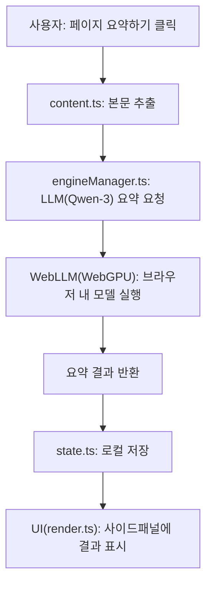

# NoServer.ai

**On-device Web Summarizer for Chrome**

NoServer.ai는 WebLLM으로 웹페이지를 브라우저 안에서 바로 요약하는 Chrome 확장입니다. 서버로 데이터를 보내지 않고, API 키나 가입 없이 쓸 수 있으며 오프라인에서도 동작합니다.

[Chrome 웹스토어에서 설치하기](https://chromewebstore.google.com/detail/noserverai/pibgbfelegjdiiohmgamhaegfkinbfjg?authuser=0&hl=en)

[개발 회고 보러가기](https://velog.io/@ihj04982/ChatGPT%EB%B3%B4%EB%8B%A4-40%EB%B0%B0-%EB%8A%90%EB%A6%B0-AI%EB%A5%BC-%EB%A7%8C%EB%93%A0-%EC%9D%B4%EC%9C%A0-%EB%B8%8C%EB%9D%BC%EC%9A%B0%EC%A0%80-%EC%98%A8%EB%94%94%EB%B0%94%EC%9D%B4%EC%8A%A4-AI-%EA%B0%9C%EB%B0%9C%EA%B8%B0-lmft186o)

---

## 주요 특징

- Qwen-3 LLM을 브라우저에서 실행해 페이지를 요약합니다.
- 요약 데이터는 외부 서버로 나가지 않습니다.
- 오프라인에서도 동작합니다.
- 사이드패널에서 요약과 기록을 관리할 수 있습니다.
- 요약 내역은 로컬 스토리지에 자동 저장됩니다.
- 무료이며, 가입이나 API 키가 필요 없습니다.

---

## 이런 데 쓸 수 있어요

- 긴 뉴스 기사 → 요약해서 SNS에 공유할 때
- 블로그나 기술 문서를 빠르게 훑고 싶을 때
- 내부망/인트라넷 문서를 오프라인에서 요약하려고 할 때
- 민감한 정보를 다루는 환경에서 서버 없는 LLM 요약이 필요할 때

---

## 기술적 개요

- Manifest V3 기반 Chrome Extension
- [@mlc-ai/web-llm](https://github.com/mlc-ai/web-llm)으로 Qwen-3 LLM 실행 (WebGPU 사용)
- [@mozilla/readability](https://github.com/mozilla/readability)로 본문 추출
- Chrome Storage API로 요약 기록 저장

### 폴더/파일 구조

- `src/background.ts`: 서비스워커, 데이터 관리, 메시지 라우팅
- `src/engine/engineManager.ts`: LLM 엔진 초기화 및 요약 처리
- `src/content.ts`: 웹페이지 본문 추출
- `src/sidepanel.ts`, `src/ui/`: 사이드패널 UI 및 이벤트 처리
- `src/state/state.ts`: 요약 기록 및 상태 관리
- `src/sw/serviceWorkerAPI.ts`: 서비스워커와의 통신 API

---

## Why these technologies?

- **WebLLM + WebGPU**: 서버 없이 브라우저에서 LLM을 돌리는 오픈소스 프레임워크입니다. WebGPU로 GPU에서 추론하고, 데이터가 밖으로 나가지 않습니다.
- **Qwen-3**: 경량 LLM 중 한글 요약이 괜찮고, 브라우저에서 돌릴 수 있는 크기(Qwen3-4B-q4f16_1-MLC)로 실사용이 가능합니다.
- **@mozilla/readability**: 페이지 본문을 골라 주는 라이브러리입니다. XPath/CSS 수동 지정 없이도 본문을 잘 뽑아 줍니다.
- **Manifest V3**: 크롬 확장 최신 스펙이라 보안·성능 측면에서 유리합니다.

---

## 요약 동작 흐름 (Flowchart)


```mermaid
flowchart TD
    A["사용자: 페이지 요약하기 클릭"] --> B["content.ts: 본문 추출"]
    B --> C["engineManager.ts: LLM(Qwen-3) 요약 요청"]
    C --> D["WebLLM(WebGPU): 브라우저 내 모델 실행"]
    D --> E["요약 결과 반환"]
    E --> F["state.ts: 로컬 저장"]
    F --> G["UI(render.ts): 사이드패널에 결과 표시"]
```

---

## 한계와 주의사항

- 첫 실행 시 모델(수백 MB)을 받아서 1~2분 걸립니다. 한 번 받으면 다시 받지 않습니다.
- WebGPU가 없으면 동작하지 않습니다. Chrome 113 이상, 최신 GPU 드라이버가 필요합니다.
- 모델이 커서 저사양 PC에서는 느리거나 브라우저가 종료될 수 있습니다.
- 텍스트는 3,000자 이하일 때 가장 잘 맞춰져 있습니다.

---

## 개발 및 빌드

```bash
npm install
npm run build
```

- Chrome 확장 프로그램 → "압축해제된 확장 프로그램"으로 `dist` 폴더 로드

---

## 시스템 요구사항

Chrome 113 이상, WebGPU 지원 GPU가 필요합니다. 첫 실행 시 모델을 한 번 받는데 1~2분 걸리며, 텍스트는 3,000자 이하가 좋습니다.

---

## 누가 쓰기 좋은지

개인정보를 서버로 보내지 않고 요약하고 싶은 분, 클라우드 API 없이 로컬 LLM을 쓰고 싶은 개발자, 속도보다 프라이버시를 우선하는 분에게 적합합니다.
